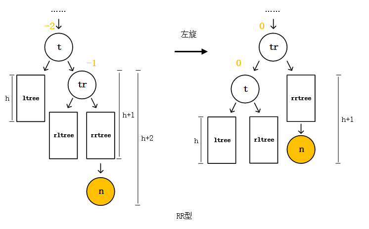
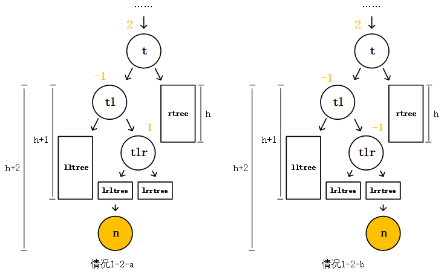
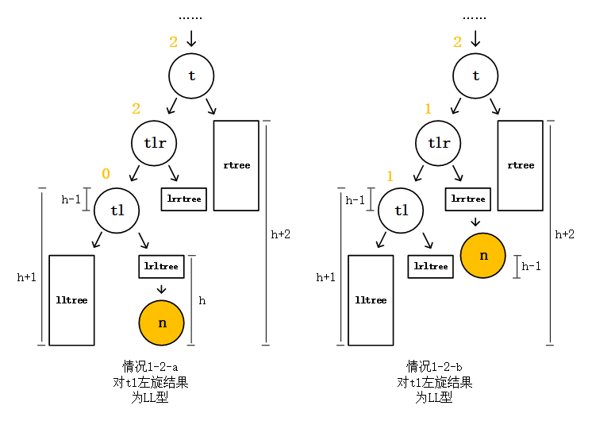
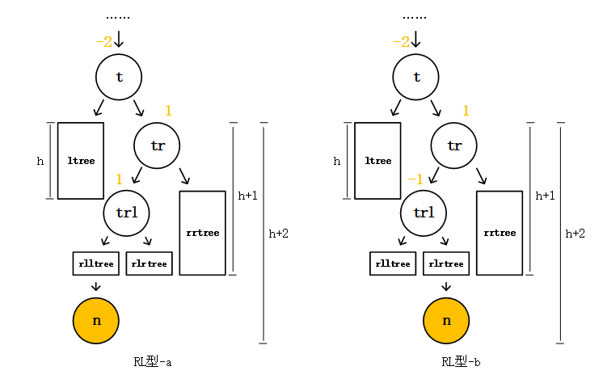
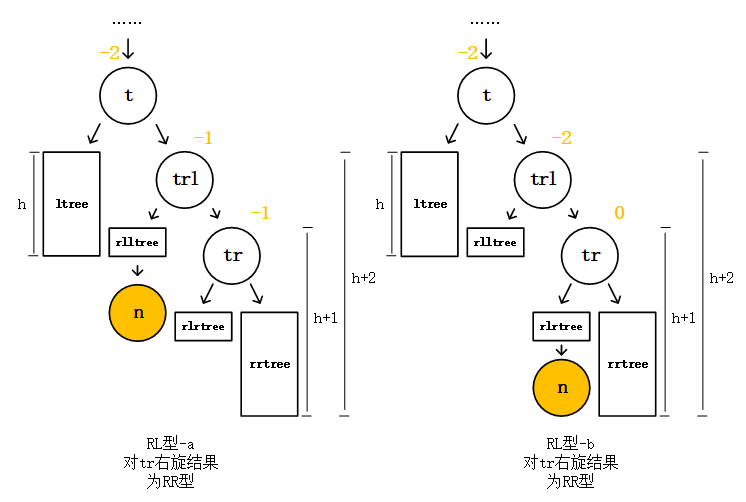
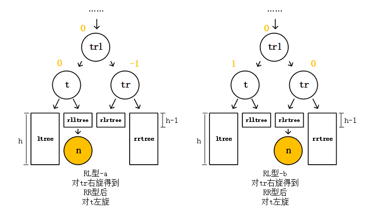

## 定义
AVL树或者是一颗空树，或者是满足下列条件的二叉搜索树：它的左、右字数都是AVL树，并且左右子树的高度差不超过1，即每个节点的左、右子树高度之差均不超过1。

## 将二叉查找树调整为AVL树
节点定义
```C
typedef struct AVLNode {
    int data;
    int height;
    struct AVLNode* left;
    struct AVLNode* right;
} AVLNode, *Nodeptr;
```

### RR型不平衡
右孩子的右子树插入节点导致失衡，用左单旋转法调整。


```C
Nodeptr RR_single_rotation(Nodeptr root) {
    Nodeptr new_root = root->right;
    root->right = new_root->left;
    new_root->left = root;
    // 更新高度
    root->height = max(getHeight(root->left), getHeight(root->right)) + 1;
    new_root->height = max(getHeight(new_root->left), getHeight(new_root->right)) + 1;
    return new_root;
}
```

### LL型不平衡
左孩子的左树插入节点导致失衡，用右单旋转法调整

```C
Nodeptr LL_single_rotation(Nodeptr root) {
    Nodeptr new_root = root->left;
    root->left = new_root->right;
    new_root->right = root;
    // 更新高度
    root->height = max(getHeight(root->left), getHeight(root->right)) + 1;
    new_root->height = max(getHeight(new_root->left), getHeight(new_root->right)) + 1;
    return new_root;
}
```

### LR型不平衡
左孩子的右子树插入节点导致失衡，先左后右双向旋转调整




```C
Nodeptr LR_double_rotation(Nodeptr root) {
    root->left = RR_single_rotation(root->left);
    return LL_single_rotation(root);
}
```

### RL型不平衡
右孩子的左子树插入节点导致失衡，先右后左双向旋转调整



```C
Nodeptr RL_double_rotation(Nodeptr root) {
    root->right = LL_single_rotation(root->right);
    return RR_single_rotation(root);
}
```

### 插入节点
```C
Nodeptr insertAVL(Nodeptr root, int x) {
    if (root == NULL) {
        root = (Nodeptr)malloc(sizeof(AVLNode));
        root->data = x;
        root->height = 1;
        root->left = root->right = NULL;
        return root;
    }

    if (x < root->data)
        root->left = insertAVL(root->left, x);
    else if (x > root->data)
        root->right = insertAVL(root->right, x);
    else
        return root; // duplicate not allowed

    // 更新高度
    root->height = 1 + max(getHeight(root->left), getHeight(root->right));

    // 获取平衡因子
    int balance = getHeight(root->left) - getHeight(root->right);

    // 四种失衡情况
    if (balance > 1 && x < root->left->data)
        return LL_single_rotation(root);
    if (balance < -1 && x > root->right->data)
        return RR_single_rotation(root);
    if (balance > 1 && x > root->left->data)
        return LR_double_rotation(root);
    if (balance < -1 && x < root->right->data)
        return RL_double_rotation(root);

    return root;
}
```

### 删除节点
```C
Nodeptr deleteAVL(Nodeptr root, int x) {
    if (!root) return NULL;

    if (x < root->data) {
        root->left = deleteAVL(root->left, x);
    } else if (x > root->data) {
        root->right = deleteAVL(root->right, x);
    } else {
        // 找到要删除的节点
        if (!root->left || !root->right) {
            Nodeptr temp = root->left ? root->left : root->right;
            if (!temp) {
                temp = root;
                root = NULL;
            } else {
                *root = *temp;
            }
            free(temp);
        } else {
            // 找右子树最小值替代
            Nodeptr temp = root->right;
            while (temp->left) temp = temp->left;
            root->data = temp->data;
            root->right = deleteAVL(root->right, temp->data);
        }
    }

    if (!root) return NULL;

    // 更新高度
    root->height = 1 + max(getHeight(root->left), getHeight(root->right));

    // 获取平衡因子
    int balance = getHeight(root->left) - getHeight(root->right);

    // 平衡修复
    if (balance > 1 && getHeight(root->left->left) >= getHeight(root->left->right))
        return LL_single_rotation(root);
    if (balance > 1 && getHeight(root->left->left) < getHeight(root->left->right))
        return LR_double_rotation(root);
    if (balance < -1 && getHeight(root->right->right) >= getHeight(root->right->left))
        return RR_single_rotation(root);
    if (balance < -1 && getHeight(root->right->right) < getHeight(root->right->left))
        return RL_double_rotation(root);

    return root;
}
```